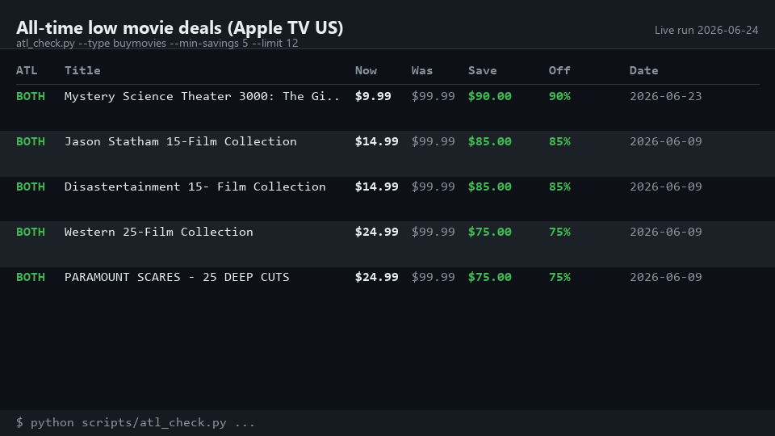
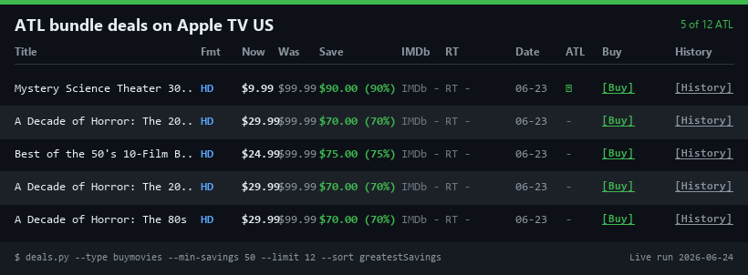
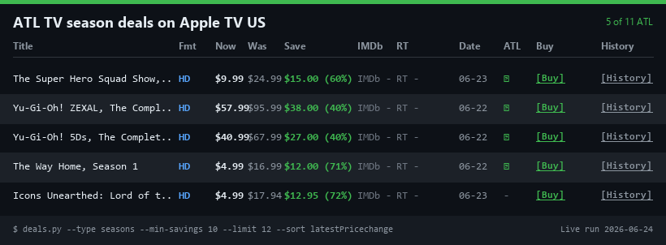
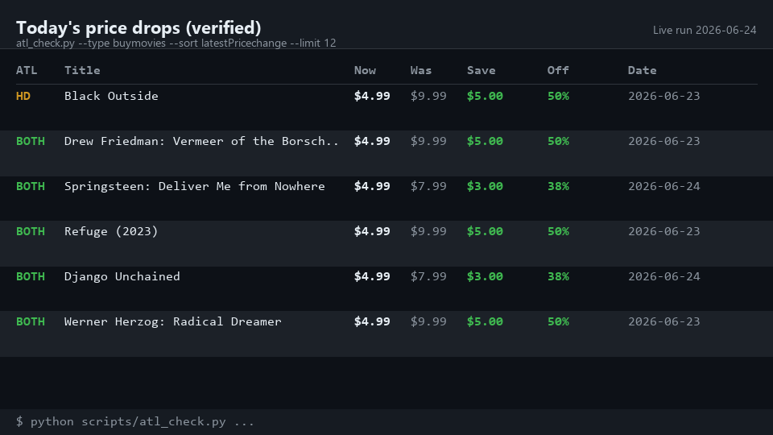

<p align="center">
  
</p>

# CheapCharts Skill 

> Agent skill for finding digital movie and TV deals across iTunes/Apple TV, Amazon, Vudu, and Google Play - with a markdown deal report that flags which drops are at their all-time low.

CheapCharts shows price drops. This skill pulls the current deals for a store (iTunes has the deepest catalog; the other three are queryable per store or via Topseller), verifies each one against the historical price record (DetailData endpoint), and gives an agent a clean markdown table to answer questions like "what's the latest on Apple TV" or "what's actually at its lowest price ever."

<p>
  <a href="https://github.com/tracerman/cheapcharts-skill"></a>
  <a href="https://github.com/tracerman/cheapcharts-skill/blob/main/LICENSE"></a>
  <a href="https://github.com/tracerman/cheapcharts-skill/releases"></a>
  <a href="https://github.com/tracerman/cheapcharts-skill/actions"></a>
  <br>
  <a href="https://github.com/tracerman/cheapcharts-skill/issues"></a>
  <a href="https://github.com/tracerman/cheapcharts-skill/commits/main"></a>
  <a href="https://www.skills.sh/tracerman/cheapcharts-skill"></a>
  
</p>

## What you can ask

Installed as a skill, you don't touch the CLI. You ask, and the agent runs the script and reads back the result:

- "What are the latest deals on Apple TV?"
- "Has *The Thing* ever been cheaper than it is right now?"
- "Any horror under $5 that's actually at its lowest price ever?"
- "Best classic noir on Apple TV with a real deal on it right now?"

The script emits a markdown table for direct use in reports, chat, and READMEs, plus JSON for cron pipelines. The same skill drives both a scheduled "post today's deals" job and an ad-hoc question.

## Demo

Four independent runs against the live CheapCharts API on 2026-06-24, each capturing a different use case the skill is designed for.

| | |
|:---:|:---:|
|  |  |
| ATL movie deals (with IMDb + RT) | Multi-film bundle deals |
|  |  |
| TV season deals at ATL | Today's price drops |

The `deals.py` script outputs a markdown table:

**5 buymovies** (out of 5 checked)

| Title | Fmt | Now | Was | Save | IMDb | RT | Date | ATL | Buy | History |
|---|:-:|---:|---:|---|:-:|:-:|---|:-:|:-:|:-:|
| [Burt](https://tv.apple.com/us/movie/umc.cmc.7dlscf08qk4gtqad1ysutbs31?at=1l3v4gB) | HD | $9.99 | $11.99 | $2.00 (17%) | - | - | 2026-06-23 | ✓ | [Buy](https://tv.apple.com/us/movie/umc.cmc.7dlscf08qk4gtqad1ysutbs31?at=1l3v4gB) | [History](https://www.cheapcharts.com/us/itunes/movies/1888698719) |
| [Going Clear](https://tv.apple.com/us/movie/umc.cmc.5sjuv6fnbcpgjkaiion1hb7yt?at=1l3v4gB) | HD | $6.99 | $12.99 | $6.00 (46%) | 8 | 95 | 2026-06-23 | - | [Buy](https://tv.apple.com/us/movie/umc.cmc.5sjuv6fnbcpgjkaiion1hb7yt?at=1l3v4gB) | [History](https://www.cheapcharts.com/us/itunes/movies/1876110281) |
| [Springsteen: Deliver Me from Nowhere](https://tv.apple.com/us/movie/umc.cmc.44ij3fzlajh43wxngtyxd6ioi?at=1l3v4gB) | 4K | $4.99 | $7.99 | $3.00 (38%) | 6.7 | 61 | 2026-06-24 | ✓ | [Buy](https://tv.apple.com/us/movie/umc.cmc.44ij3fzlajh43wxngtyxd6ioi?at=1l3v4gB) | [History](https://www.cheapcharts.com/us/itunes/movies/1853855567) |

The `ATL` column shows `✓` for titles currently at their all-time low and `-` for typical sales. The `[Buy](url)` link goes to the Apple TV purchase page; `[History](url)` goes to the CheapCharts price-history page. Titles are direct-clickable (each `[Title](url)` links to Apple TV). Format column shows `4K` / `HD` / `SD` based on `has4K` in DetailData. IMDb and RT columns show `-` for bundles and TV seasons (CheapCharts doesn't carry ratings for those item types).

## How it works

Three layers:

- **Deals endpoint** returns the current deal list with prices, ratings, and category metadata. iTunes has the most complete catalog.
- **DetailData endpoint** returns per-title price history with the `priceHdIsLowest` / `priceSdIsLowest` flags - the authoritative ATL signal.
- **Script (`deals.py`)** fetches Deals, then hits DetailData in parallel (8 concurrent workers, ~12 seconds for 50 items) and merges the results into a single table, preserving the API's sort order.

Noise controls are explicit flags: `--min-savings 1` skips sub-dollar "drops", `--exclude-bundles` removes multi-film collections, and `--since N` keeps only recent changes. The default shows everything so the ATL column can tell the real story.

## What's new in v3.1

- **`--since N`** - filter to deals whose price actually changed in the last N days ("today's drops" is now one flag).
- **Windows fixed** - output is forced to UTF-8; batch mode no longer crashes on cp1252 consoles.
- **Stable ordering** - results come back in the API's sort order (parallel fetching used to scramble it).
- **Genre validation** - `--genre horror` now normalizes to `Horror`; unknown genres error instead of silently returning every deal.
- **Failure accounting** - failed DetailData lookups are counted and reported instead of silently dropped; transient errors retry.
- **Leaner skill** - SKILL.md went from ~60KB to ~12KB via progressive disclosure; the 37-pitfall knowledge base now lives in [references/PITFALLS.md](skills/cheapcharts/references/PITFALLS.md) and is re-verified weekly by a CI canary.

## What's new in v3.0

The default output is now "all deals with ATL flag" instead of "ATL-only." Pass `--atl-only` to filter to ATL rows only (v2.x behavior). Use the default for "what's the latest" questions; use `--atl-only` when the user asks "what's at its all-time low."

See [Pitfall #33](skills/cheapcharts/references/PITFALLS.md#33-v30-reframed-the-script-from-atl-only-to-deals-with-atl-flag---old-defaults-no-longer-apply) for the full set of v3.0 changes.

## Supported stores

| Store | Country support | Coverage |
|---|---|---|
| iTunes / Apple TV | us, de, gb, fr, au, ca, at, ch, es, pt, ru, jp, tr, pl, in, cn | Full. The default, and where the script works best. |
| Amazon | us, de | Via `--store amazon`. Batch mode often returns a server-side error; single-title lookups work but data is sparser than iTunes. |
| Vudu | us | Via `--store vudu`. Data is sparser than iTunes. |
| Google Play | us | Via `--store googlePlay`. Data is sparser than iTunes. |

iTunes and Apple TV are the same underlying catalog (Apple rebranded iTunes Movies & TV Shows to the Apple TV app in 2019). The script defaults to iTunes because that's where CheapCharts has the most complete catalog and the most reliable deals endpoint. For non-iTunes stores, prefer `--title` lookups over batch mode.

## Install on every major agent platform

| Platform | Install |
|---|---|
| skills.sh (any agent) | `npx skills add tracerman/cheapcharts-skill` |
| Hermes Agent | `hermes skills install tracerman/cheapcharts-skill` |
| Claude Code | Install the skill itself (see below) - it ships SKILL.md **and** the script together |
| Claude Desktop | Upload the [latest release zip](https://github.com/tracerman/cheapcharts-skill/releases/latest/download/cheapcharts-claude-desktop.zip) via Settings > Features > Skills |
| Plain Python | Clone and run `deals.py` directly (see below) |

**Claude Code (skill):**

```bash
git clone https://github.com/tracerman/cheapcharts-skill /tmp/cheapcharts-skill
mkdir -p ~/.claude/skills
cp -r /tmp/cheapcharts-skill/skills/cheapcharts ~/.claude/skills/cheapcharts
```

This installs the full package - SKILL.md, the reference files, and `scripts/deals.py`. (The old curl-one-file slash-command install is deprecated: it delivered a command that referenced a script it never downloaded. The [slash command](skills/cheapcharts/claude-code/cheapcharts.md) still exists as an optional alias, but it requires the skill above to be installed.)

**Claude Desktop** requires a Pro/Max/Team/Enterprise plan with code execution enabled. Download [`cheapcharts-claude-desktop.zip`](https://github.com/tracerman/cheapcharts-skill/releases/latest/download/cheapcharts-claude-desktop.zip) (built automatically by the release workflow), then Settings > Features > Skills > Upload.

**Plain Python** (no agent), Python 3.9+, standard library only:

```bash
git clone https://github.com/tracerman/cheapcharts-skill
cd cheapcharts-skill/skills/cheapcharts
python scripts/deals.py --title "Fight Club"
```

## Repo structure (skill package)

```
cheapcharts-skill/
├── .github/
│   ├── scripts/canary_pitfalls.py     # re-tests the empirical API claims weekly
│   └── workflows/
│       ├── tests.yml                  # PR CI: ruff + offline pytest (3.9/3.11/3.13)
│       ├── canary.yml                 # weekly live-API canary, opens issue on drift
│       └── release.yml                # tag-triggered zip build + GitHub release
├── LICENSE                            # MIT
├── README.md                          # this file
├── pyproject.toml                     # ruff + pytest config
├── assets/
│   └── header.png                     # brand banner for the README
├── tests/                             # offline unit tests (fixtures, no network)
└── skills/
    └── cheapcharts/
        ├── SKILL.md                   # lean skill manifest (~12KB, always loaded)
        ├── RECIPES.md                 # copy-pasteable curl recipes + cron prompts
        ├── README.md                  # per-skill landing page
        ├── references/
        │   ├── API.md                 # full endpoint/enum/field reference
        │   ├── PITFALLS.md            # all 37 empirically-verified API pitfalls
        │   └── EXTRAS.md              # gift cards, Movies Anywhere, seasonal calendar
        ├── examples/
        │   ├── demo-movies-2026-06-24.png      # ATL movie deals (with IMDb + RT)
        │   ├── demo-bundles-2026-06-24.png     # multi-film bundle deals
        │   ├── demo-seasons-2026-06-24.png     # TV season deals
        │   └── demo-today-2026-06-24.png       # today's price drops
        ├── scripts/
        │   └── deals.py               # the parallel deal/ATL finder
        └── claude-code/
            └── cheapcharts.md         # optional slash-command alias (needs the skill)
```

This is the canonical [Agent Skills](https://agentskills.io/specification) layout: one repo, one or more skill subdirectories under `skills/`, each with a `SKILL.md` and optional `scripts/`, `references/`, `assets/`. Tools like `npx skills add` and `hermes skills install` understand this layout.

## Contributing

Issues and PRs welcome. Run `ruff check` and `pytest tests` before submitting (both run offline). The most useful contributions:

- New recipes for `RECIPES.md` (check `scripts/` first - see Pitfall #29)
- Multi-store parallelization (`--stores itunes,amazon,...` fan-out; the bundled script is one-store-per-run today)
- More robust ATL detection (`priceHdIsLowest` is the only ATL signal the API exposes directly)
- New pitfalls for `references/PITFALLS.md` - append-only, with the verification date; add a canary check in `.github/scripts/canary_pitfalls.py` if the claim is load-bearing
- Real examples in `examples/`

## Links

- **Mobile apps:** CheapCharts Movie & TV Deals (iOS: id772046134, Android: com.lollipapp.cc), CheapCharts Games (iOS: id1622193150, Android: com.cheapcharts.cheapcharts_games)
- **JSON-LD hints:** Key CheapCharts website pages expose JSON-LD `potentialAction` hints that link directly to the GPT API endpoints with pre-filled parameters. Use as a browser-based fallback if the API doesn't cover a specific query.
- **Apple TV app gap:** The Apple TV app uses a different catalog index than iTunes. Many deals (boxsets, complete series bundles, older catalog titles) appear on CheapCharts/iTunes but are invisible in the Apple TV app. If a user can't find a deal in Apple TV, direct them to the iTunes purchase link (`productPageUrl` or `iTunesUrl` from DetailData).

## License

MIT. See [LICENSE](LICENSE).

*Built by [tracerman](https://github.com/tracerman) with love and coffee.*
