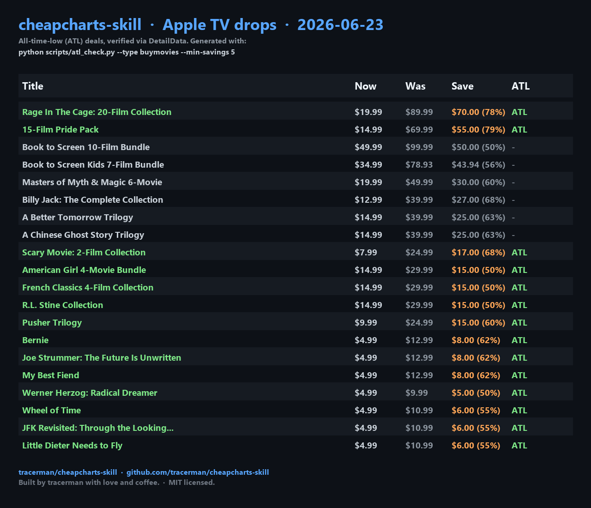

# CheapCharts Skill (by tracerman)

> A free, public-API price tracker for digital movies and TV shows on iTunes/Apple TV, Amazon, Vudu, and Google Play - with a parallel ATL checker that scans 50 drops in ~12s (the website only shows the ATL badge on individual title pages, so bulk checking means 50 clicks).

*Built by [tracerman](https://github.com/tracerman) with love and coffee.*

<p>
  <a href="https://github.com/tracerman/cheapcharts-skill"></a>
  <a href="https://github.com/tracerman/cheapcharts-skill/blob/main/LICENSE"></a>
  <a href="https://github.com/tracerman/cheapcharts-skill/releases"></a>
  <a href="https://github.com/tracerman/cheapcharts-skill/actions"></a>
  <br>
  <a href="https://github.com/tracerman/cheapcharts-skill/issues"></a>
  <a href="https://github.com/tracerman/cheapcharts-skill/commits/main"></a>
  <a href="https://skills.sh/"></a>
  
</p>

## Demo



The screenshot above is real output - the script ran against the live CheapCharts API on 2026-06-23 and verified each drop's `priceHdLastChangeDate` against the internal `DetailData` endpoint. ATL rows are highlighted in green; non-ATL rows show a `-` in the ATL column.

## What is this

This is an **agent skill** that lets any AI agent (Hermes, Claude Code, OpenAI Codex, Cursor, etc.) look up movie and TV show prices across all four major US digital stores, and check whether a given drop is at the historical floor (all-time low / ATL).

It wraps the [CheapCharts public API](https://www.cheapcharts.com/us/ai) (no auth required; `DetailData` is rate-sensitive at high concurrency, hence the 12-worker cap) and includes:

- A complete `SKILL.md` manifest with all endpoints, recipes, and pitfalls
- A parallel `atl_check.py` script that finds ATL deals in ~12 seconds for 50 items
- Support for purchase (`buymovies`) and rental (`rentalmovies`) price lookups
- Filterable by genre, max price, release year, quality, and IMDb/Rotten Tomatoes rating
- A real example deal report from today
- A Claude Code slash command
- A GitHub Actions smoke test

## Install

The skill lives at [`skills/cheapcharts/`](skills/cheapcharts/). Install it with whatever skill tool your agent uses:

**Vercel / skills.sh (any agent):**
```bash
npx skills add tracerman/cheapcharts-skill
# or just this one skill:
npx skills add tracerman/cheapcharts-skill --skill cheapcharts
```

**Hermes Agent:**
```bash
hermes skills install tracerman/cheapcharts-skill
```

**Claude Code (slash command):**
```bash
mkdir -p ~/.claude/commands
curl -L https://raw.githubusercontent.com/tracerman/cheapcharts-skill/main/skills/cheapcharts/claude-code/cheapcharts.md \
  -o ~/.claude/commands/cheapcharts.md
```
Then type `/cheapcharts` in Claude Code.

**Claude Desktop (upload skill zip):**
1. Download [`cheapcharts-claude-desktop.zip`](https://github.com/tracerman/cheapcharts-skill/releases/download/v2.2.0/cheapcharts-claude-desktop.zip)
2. Open Claude Desktop > Settings > Features > Skills
3. Click "Upload" and select the zip file
4. Requires Pro/Max/Team/Enterprise plan with code execution enabled

**Plain Python (no agent):**
```bash
git clone https://github.com/tracerman/cheapcharts-skill
cd cheapcharts-skill/skills/cheapcharts
python scripts/atl_check.py --title "Fight Club"
```
Requires Python 3.9+ (uses stdlib only).

## Quick example

```
$ python scripts/atl_check.py --type buymovies --min-savings 5

TITLE                            NOW     WAS     SAVE    ATL  IMDb  CHANGED
Rage In The Cage: 20-Film...    $19.99  $89.99  $70.00  ATL  -     2026-06-23
15-Film Pride Pack              $14.99  $69.99  $55.00  ATL  -     2026-06-23
A Better Tomorrow Trilogy       $14.99  $39.99  $25.00  -    -     2026-06-23
Bernie                           $4.99  $12.99   $8.00  ATL  -     2026-06-23
Werner Herzog: Radical Dreamer   $4.99   $9.99   $5.00  ATL  -     2026-06-23
...
```

Combined filters (genre + max price + min savings):

```
$ python scripts/atl_check.py --genre Horror --max-price 4.99 --min-savings 3

=== 9 buymovies currently at ATL (out of 10 checked) [genre=Horror, maxPrice=$4.99] ===

  [BOTH] Human Resources | $1.99 (was $14.99, save $13.00) | changed 2023-05-29
  [BOTH] The Housemaid (2018) | $4.99 (was $14.99, save $10.00) | changed 2025-05-02
  ...
```

See [`skills/cheapcharts/examples/today-2026-06-23.md`](skills/cheapcharts/examples/today-2026-06-23.md) for a full real-world report.

## Repo structure (skill package)

```
cheapcharts-skill/
├── README.md                          # this file (install + overview)
├── LICENSE                            # MIT
├── .github/workflows/tests.yml        # CI smoke test
└── skills/
    └── cheapcharts/                   # the skill itself
        ├── SKILL.md                   # manifest (frontmatter + body)
        ├── RECIPES.md                 # literal curl recipes
        ├── scripts/atl_check.py       # parallel ATL checker
        ├── examples/                  # sample deal reports
        └── claude-code/cheapcharts.md # slash command
```

This is the canonical [Agent Skills](https://agentskills.io/specification) layout: a "skill package" repo where each skill lives in its own subdirectory under `skills/`. Tools like `npx skills add` and `hermes skills install` understand this layout.

## Why this exists

CheapCharts' website shows an ATL badge the first time a title hits the historical floor, but it does not surface concurrent ATLs - i.e. it will not tell you that a price currently sitting at the floor *was already at the floor last week*. Its deals-listing endpoints (`buymovies`, `rentalmovies`) only return price+title, with no `DetailData` fields, so you can't see which of today's drops are at the floor without checking each one. This skill wraps the same `DetailData` endpoint the site uses and hits it in parallel, so you can see exactly which of today's drops are at the historical floor and which are just typical sales, in ~12s for 50 items instead of 50 page loads. It gives you a script that:

- Pulls the latest deals from CheapCharts (iTunes works best; Amazon/Vudu/Google Play supported but sparser)
- Hits DetailData in parallel (12 workers, ~12s for 50 items)
- Tells you which drops are at the historical floor (`ATL`) vs. just a typical sale
- Skips "fake drops" (manipulated `priceBefore` baselines, <$1 changes)
- Outputs JSON for cron pipelines or pretty tables for humans

## Supported stores

| Store | Country support | Coverage |
|---|---|---|
| iTunes / Apple TV | us, de, gb, fr, au, ca, at, ch, es, pt, ru, jp, tr, pl, in, cn | Full - this is the default and where the script works best |
| Amazon | us, de | Supported via `--store amazon`; batch mode often returns a server-side error, single-title lookups work but data is sparser than iTunes |
| Vudu | us | Supported via `--store vudu`; data is sparser than iTunes |
| Google Play | us | Supported via `--store googlePlay`; data is sparser than iTunes |

iTunes and Apple TV are used interchangeably - same underlying catalog. Apple rebranded iTunes Movies & TV Shows to the Apple TV app in 2019. The script defaults to iTunes because that's where CheapCharts has the most complete catalog and the most reliable Deals endpoint. For non-iTunes stores, prefer `--title` lookups over batch mode.

## Install on every major agent platform

| Platform | Install |
|---|---|
| Vercel / skills.sh (any agent) | `npx skills add tracerman/cheapcharts-skill` |
| Hermes Agent | `hermes skills install tracerman/cheapcharts-skill` |
| Claude Code (slash command) | Copy `skills/cheapcharts/claude-code/cheapcharts.md` to `~/.claude/commands/` |
| Claude Desktop (upload) | Download [zip](https://github.com/tracerman/cheapcharts-skill/releases/download/v2.2.0/cheapcharts-claude-desktop.zip), upload via Settings > Features > Skills |
| Plain Python | `git clone … && python skills/cheapcharts/scripts/atl_check.py --title "Bernie"` |

The skill package follows the canonical [Agent Skills spec](https://agentskills.io/specification): one repo, one or more skill subdirectories under `skills/`, each with a `SKILL.md` and optional `scripts/`, `references/`, `assets/`. Tools like `npx skills` and `hermes skills install` both understand this layout.

## Contributing

Issues and PRs welcome. The most useful contributions:

- New recipes for the SKILL.md / RECIPES.md
- More robust ATL detection (`priceHdIsLowest` is the only ATL signal the API exposes directly; the only alternatives are deriving it from `priceHdLastChangeDate` + your own price history)
- Multi-store parallelization (bundled script is iTunes-only by default)
- Real examples in `examples/`

## Links

- CheapCharts website: https://www.cheapcharts.com
- CheapCharts blog: https://www.cheapcharts.com/blog
- CheapCharts on Twitter/X: @CheapCharts_US
- CheapCharts iOS app: [App Store](https://apps.apple.com/app/cheapcharts/id772046134)
- CheapCharts Android app: [Google Play](https://play.google.com/store/apps/details?id=com.cheapcharts.app)

## License

MIT. See [LICENSE](LICENSE).
